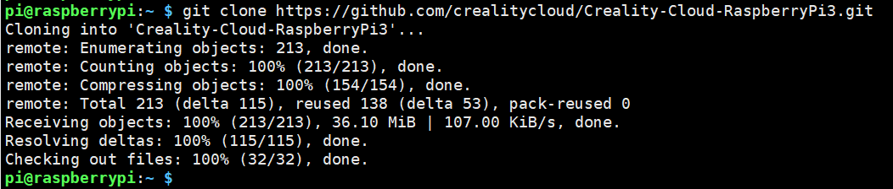
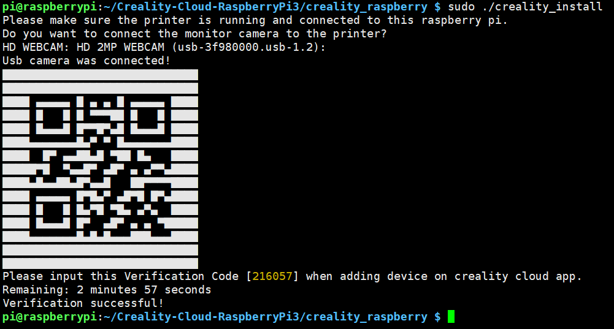
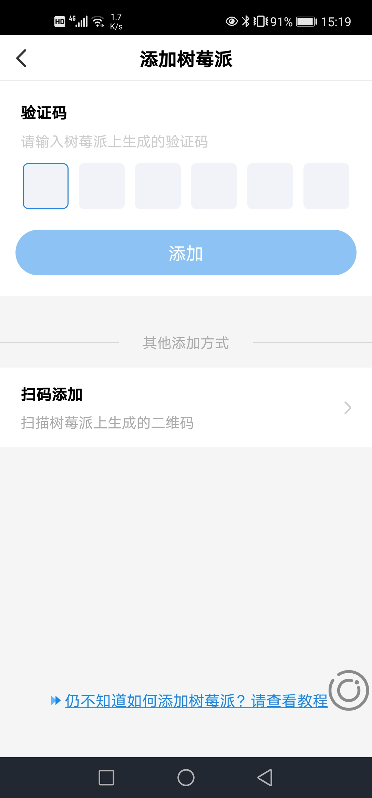
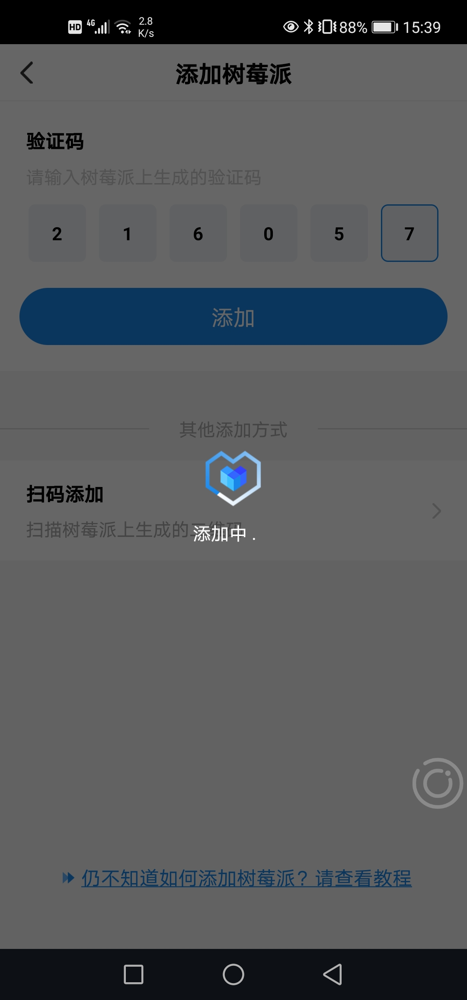
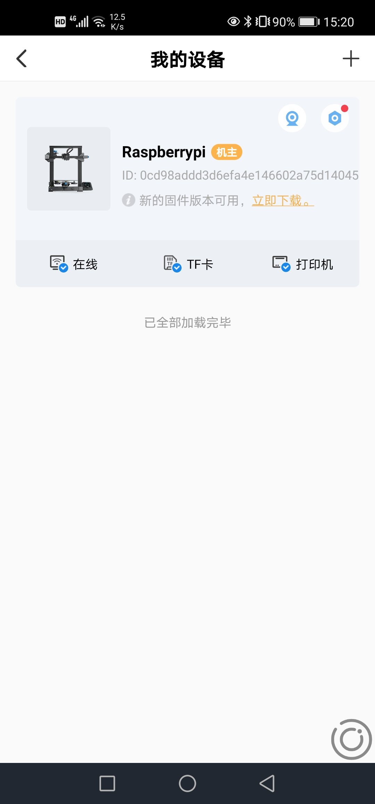

## checklist

  #### 安装创想云app、注册创想云账号
  在运行打印服务之前一定要在移动端安装创想云app和注册创想云app账号  

  IOS: https://tinyurl.com/CrealityiOS  
  Android: https://tinyurl.com/CrealityAndroid

  #### 连接打印机

    打印机一定要通过串口线连接到树莓派，并确保连接好，不然程序是安装不成功的。

  #### 连接监控摄像头
    
    如果需要使用app的监控打印机的功能请连接监控摄像头，不连接摄像头也不影响使用打印服务但是不能使用创想云app的打印机监控功能。

  #### 树莓派操作准备
      在Windows远程操作树莓派建议使用putty。
      ios远程操作直接使用终端用ssh连接。
      也可以直接使用HDMI连接显示屏幕。

## 安装创想云树莓派打印服务
#### 安装服务

  获取服务程序: git clone https://github.com/crealitycloud/Creality-Cloud-RaspberryPi3.git

  

  进入程序安装目录：cd Creality-Cloud-RaspberryPi3/creality_raspberry

  

  执行程序安装脚本：sudo ./creality_install

  生成验证码： 

  

  在app选择树莓派

  

  扫码或输入验证码添加树莓派

  
  
  

  

  服务已激活（服务已启动，不需要再次启动，每次开机会自动启动）

#### 启动服务
sudo systemctl start creality_printer.service
#### 停止服务
sudo systemctl stop creality_printer.service

#### 查看服务状态 
sudo systemctl status creality_printer.service

## 常见问题
q:远程连接被拒绝

a:确认树莓派打开ssh服务，并开了22端口。

q:树莓派git安装报错

a:sudo apt-get update，然后再sudo apt-get install git

q:在执行安装命令时报错权限不够。

a:在执行命令前加上sudo。

q:电压不稳，树莓派系统不断重启。

a:建议使用5v2A树莓派官方指定的电源适配器和电源线。

q:在安装过程中报错：is not a command.

a：仔细检查下命令是否输入错误，建议直接使用复制粘贴。
