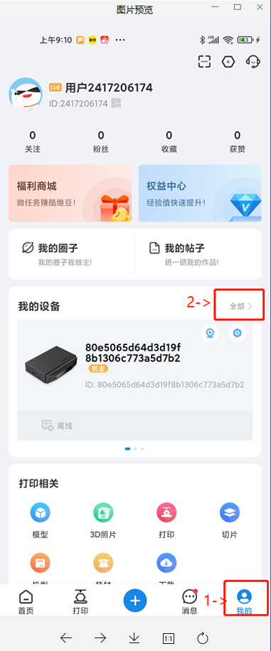
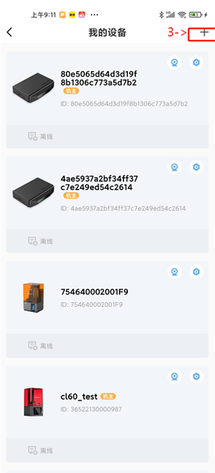
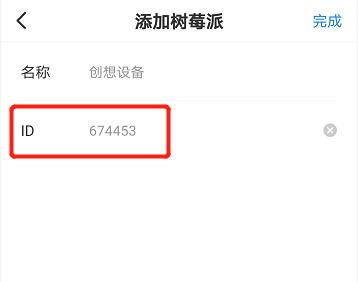
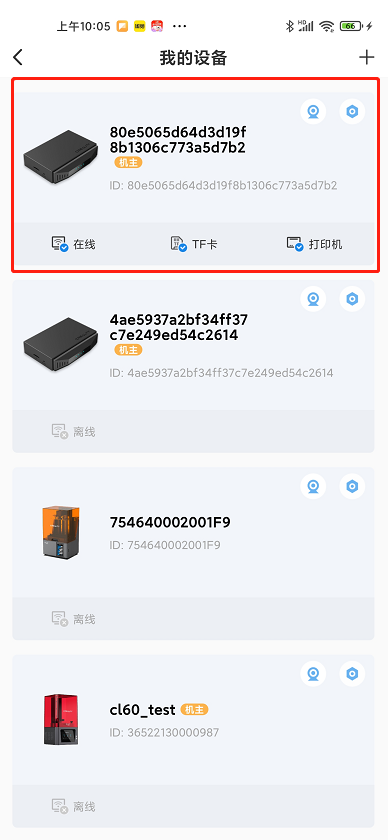
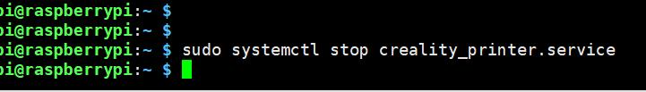

## 安装创想云app、注册创想云账号
在运行打印服务之前一定要在移动端安装创想云app和注册创想云app账号  

IOS: https://tinyurl.com/CrealityiOS  
Android: https://tinyurl.com/CrealityAndroid

## 安装创想云树莓派打印服务
#### 安装服务
  获取服务程序: git clone https://github.com/crealitycloud/Creality-Cloud-RaspberryPi-.git

  安装服务程序: cd Creality-Cloud-RaspberryPi-/creality_raspberry && sudo ./creality_install

  

  生成验证码： 

  

  在app上输入验证码

  
  
  

  

   

  服务已激活（服务已启动，不需要再次启动，每次开机会自动启动）

  

  

## 启动服务
sudo systemctl start creality_printer.service
## 停止服务
sudo systemctl stop creality_printer.service

## 查看服务状态 
sudo systemctl status creality_printer.service
