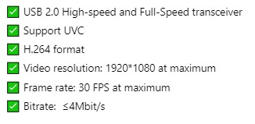
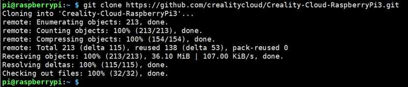
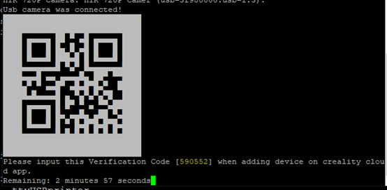
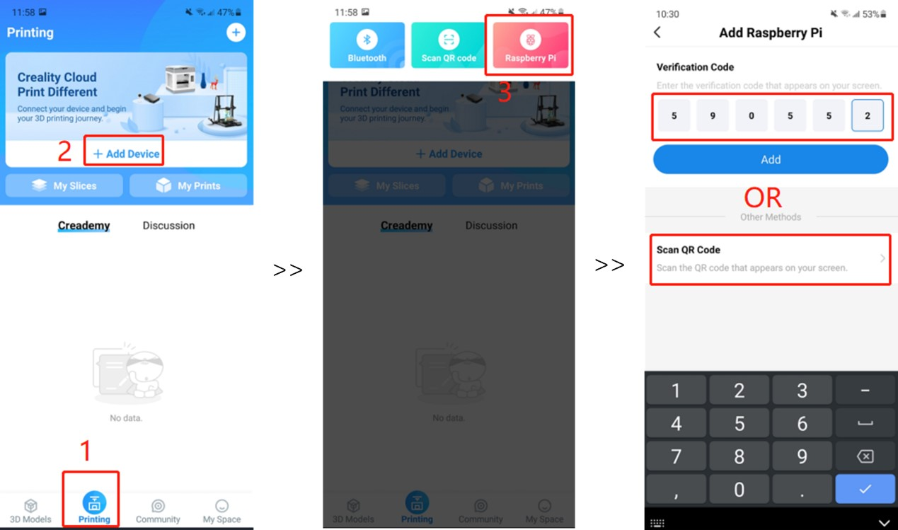
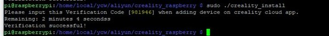
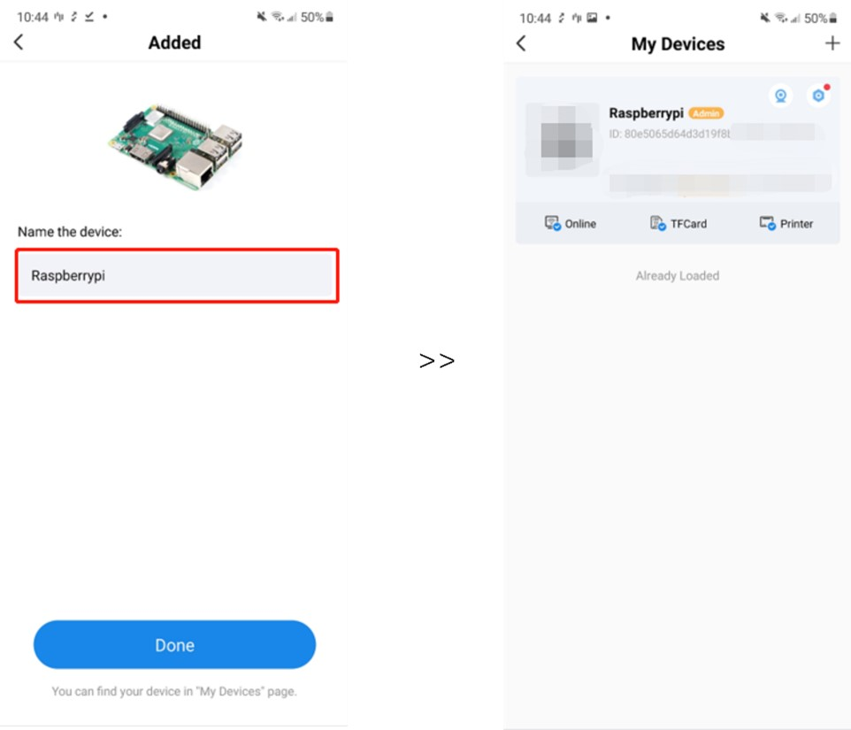
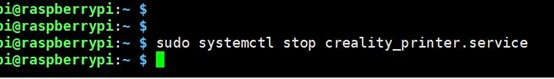

# **How to Install CrealityPi on a Raspberry Pi**

# **What is CrealityPi?**

CrealityPi is a firmware that can run on a Raspberry Pi. (What is a Raspberry Pi: [https://youtu.be/uXUjwk2-qx4](https://youtu.be/uXUjwk2-qx4))

With CrealityPi, you can remote control and monitor your 3D printer. Here are some of the things CrealityPi allows you to do:

- Manually control a Creality 3D printer using the Creality Cloud app
- Monitor and change print settings using the Creality Cloud app
- Set up a webcam to view in the Creality Cloud app
- Slice models using the Creality Cloud app

# **Before you start…**

1. **Download the Creality Cloud app**

Before installing CrealityPi on a Raspberry Pi, please make sure you have installed the Creality Cloud app (3.0 or higher) on your mobile device and registered an account on Creality Cloud.

iPhone &amp; iPad: [https://tinyurl.com/iOSCreality](https://tinyurl.com/iOSCreality)

Android: [https://tinyurl.com/CrealityAndroid](https://tinyurl.com/CrealityAndroid)

2. **Connect your 3D printer with your Raspberry Pi through a USB cable**

We recommend using a Raspberry Pi from Raspberry Pi 3 & 4 family.

3. **Connect a supported webcam with your Raspberry Pi (Optional)**

Creality webcam is recommended [https://vip.creality.com/en/goods-detail/1004](https://vip.creality.com/en/goods-detail/1004). 

If you are looking for an alternative, please make sure the camera you purchase meets the following requirements:

4. **SSH into your Raspberry Pi**

How-to video: [https://youtu.be/wOFro6GwEFQ](https://youtu.be/wOFro6GwEFQ)

Using SSH on the Raspberry Pi (10-min read): [https://pimylifeup.com/raspberry-pi-ssh/](https://pimylifeup.com/raspberry-pi-ssh/)

# **Install CrealityPi on Raspberry Pi**

1. **Install the service program**

  - Download CrealityPi:

sudo git clone [https://github.com/crealitycloud/Creality-Cloud-RaspberryPi3.git](https://github.com/crealitycloud/Creality-Cloud-RaspberryPi3.git)

  - Enter install directory:

  cd Creality-Cloud-RaspberryPi3/creality_raspberry

  - Run installer scripts:

  sudo ./creality_install

Finish the above three steps, and a verification code should be automatically generated.

In this example, the verification code is 590552 (The QR code above also contains the verification code info).

2. **Enter verification code in the Creality Cloud app**

Open the Creality Cloud app on your mobile device, tap Printing > Add Device >  Raspberry Pi. Manually enter the verification code or scan the QR code on your screen.

Hold on tight as your Raspberry Pi is being added to Creality Cloud. This should take a few moments. If everything works well, you will see Verification successful! on your screen.

3. **Name your Raspberry Pi**

Please give your Raspberry Pi a cool name and tap Done. You are all set! You can find it on the My Devices page.

# **Some useful commands**

- **Start service**

sudo systemctl start creality_printer.service

- **Stop service**

sudo systemctl stop creality_printer.service

- **Check service status**

sudo systemctl status creality_printer.service

# **Where to find us**

Facebook: [https://www.facebook.com/CrealityCloudApp](Facebook)
